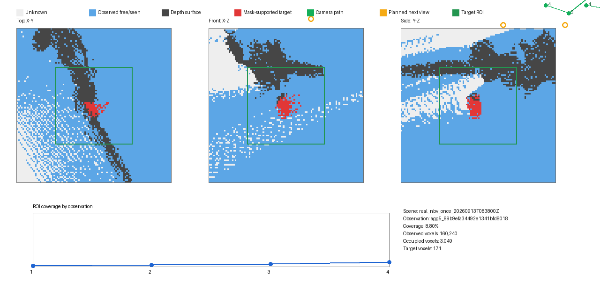
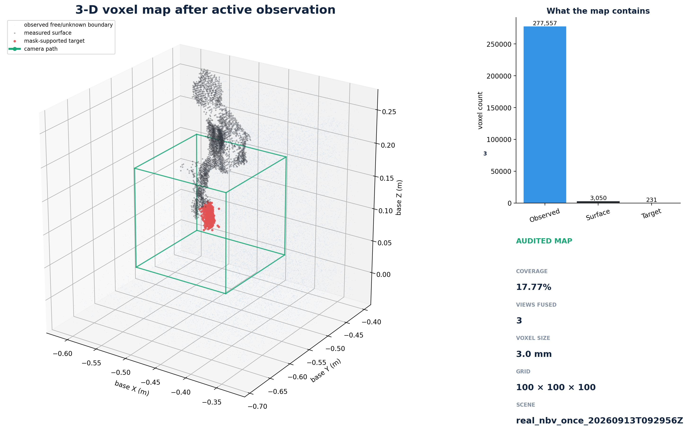

# 单臂主动感知草莓（NERO + Gemini 2 XL + Gradient-NBV）

一句话说明：相机先拍草莓，程序把看到和没看到的三维空间记在体素地图里，Gradient-NBV
选择下一观察位置，Placo 把它换成机械臂关节角，安全监督器执行小步运动后再拍照并继续更新
同一张地图。整个计算和控制链不依赖 MoveIt。

## 当前进度

已经完成并保存证据的主链路是：

```text
Gemini RGB-D → mono8 目标 mask → 统一 Observation
       → 同一张体素地图持续更新 → Gradient-NBV
       → 正式手眼外参 → Placo SolveIK → NERO 小步运动 → 再观察
```

截至 2026-09-13：

- 最新“停止条件驱动、最多 8 步”真实实验实际执行了 3 个约 10 cm 的高层动作；前两次
  动作后的观测成功加入同一张体素地图，coverage `4.94% → 11.05% → 17.77%`，两步分别
  增加 `6.11 / 6.71` 个百分点。第三次动作正常到达、累计产生 256 个平滑轨迹采样点，
  但动作后草莓 mask 与有效深度的交集变成 0，随后检查发现 Gemini USB 设备已经从电脑
  消失。监督器因此关闭两道执行门并停止，没有继续盲目运动。本次证明了“大动作连续重规划
  + 同图更新 + 输入失效即停”，但没有达到 20% coverage，所以诚实标记为未完成科学验收。
  [打开本次中文报告](artifacts/week7/presentation_run_20260913/REPORT_CN.md)。
- Placo 单臂 IK、轨迹、ROS 2 服务/Action 和真机安全门已完成；主控制测试 `106 passed`。
- Gemini 2 XL 在 `640×400@10 Hz` 下已通过 3 次冷启动和 30 分钟稳定性测试。当前线缆
  即使协商为 USB 2/480M，也足以继续这一低带宽实验。
- MoveIt-free Gradient-NBV 已通过合成五视角验收；ROI 有效射线覆盖率从 `20.69%` 增至
  `56.31%`。现在会为每次地图更新保存可重放的体素快照。
- 30 个真实姿态完成了 eye-in-hand 手眼标定；正式报告的 20/20 个留出切分通过，报告已
  放入版本库并由 SHA-256 锁定。
- 红色目标真实三步闭环使用同一张地图、只配置 1 次，覆盖率
  `24.68% → 40.72% → 44.75% → 46.37%`，总增量 `21.69` 个百分点；3 个高层运动均完成，
  每步结束后两道执行门关闭。
- 把测试物换成真实草莓后，用当前 HSV 红色规则 mask 连续完成 2 步，覆盖率
  `23.94% → 35.21% → 41.65%`。第三个建议位移不超过 1 mm；当前代码会把这种情况解释为
  “提前收敛”，但修复后尚未重新做真机复测。
- 独立 5–10 cm 配置已完成首次真机实验：相机实际移动 `48.95 mm / 2.78°`，同一张地图的
  coverage `2.09% → 4.14%`，最终误差 `1.12 mm / 0.023°`，门控和硬件状态正常。第二步
  建议在当时关节姿态下不可达，系统安全停止；这是 2026-09-10 的历史单方向结果。
- 2026-09-13 已把它升级为“多方向、多距离、先 IK 后收益”的可达候选选择，并完成真实
  三步闭环。三步实际相机平移约 `98.96 / 97.79 / 97.99 mm`，同一张地图只配置 1 次，
  coverage `1.55% → 3.24% → 5.31% → 8.80%`；三步分别增加 `1.69 / 2.06 / 3.49`
  个百分点。3 个高层目标均到达，每步结束后两道运动门关闭，最终机械臂、CAN 和关节限位
  状态正常。预设“总增量至少 20 个百分点”的科学门槛未达到，因此不能把本次写成完整
  重建验收通过；但“明显厘米级运动 + 同图连续更新 + 动态重规划”的工程流程已经跑通。

这里的 `coverage` 是“目标 ROI 中有多少体素被有效深度射线碰到”，用于比较地图是否持续
获得新信息；它不是草莓真实表面覆盖率，也不能直接解释成“看清了百分之多少草莓”。

### 为什么旧的 5 cm 实验只走了一步

“最多三步”不是要求无论如何都走满三步，而是防止程序失控的上限。程序会在以下任意一种
情况出现时停止：达到 coverage 目标、连续观察几乎没有新信息、达到步数/累计运动上限，
或者下一视角无法通过相机数据、IK、关节限位、奇异性和门控检查。

本次属于最后一种。第一步成功后，Gradient-NBV 又给出了约 10 cm 的第二视角；但当时
第 4 关节已经接近保守上限，沿同一方向缩短后的候选也没有同时满足“至少 5 cm、可达且
不贴限位”。因此程序停止。这表示安全保护正常工作，不表示 coverage 已经收敛，也不表示
第二步运动执行失败——第二步根本没有发给机械臂。

### 当前方法：只在可达候选里选 NBV，并自适应运动幅度

相机位姿是连续量，数学上有无限多个点，因此不能真的先列出“所有可达点”。当前实现采用
有限而可重复的近似：

1. 在当前相机周围按固定的 18 个球面方向生成候选位置。距离由大到小固定为
   `10 / 7.5 / 5 / 2.5 / 1 / 0.5 cm`；每个候选都朝向当前锁定的同一个草莓目标。
   这里的 5 cm 是演示优先值，不再是硬下限。
2. Placo 从当前关节角逐个求 IK，先删除不可达、接近关节限位、过于奇异或关节变化过大的
   候选。
3. Gradient-NBV 使用当前这张体素地图给剩余候选逐个计算信息收益，而不是只给一个梯度
   方向。候选必须比当前视角有正收益。
4. 先保留“收益至少达到本轮最佳增量 90%”的一组候选，再优先选择运动更明显、离关节
   限位更远的候选。这样既
   保留 NBV 的“值得观察”，又尽量让演示肉眼可见；若大动作不可达，会自动换方向或缩短，
   不会因为低于 5 cm 就直接停。
5. 没有可达且有正收益的候选、coverage 达标或进入平台期时才正常停止。候选打分使用新的
   只读接口，不会为了比较候选而重复更新地图。

这相当于先问机械臂“你能去哪儿”，再在它能去的地方里问 NBV“去哪儿最值得”。相机位姿
是连续变量，理论上有无限多个，所以不能真正枚举“所有可达点”；分层球壳加 Placo IK 是
可重复、可计算的近似。实现会保存所有候选的位置、距离、IK、关节余量和收益排序，便于在
可视化中直接看到哪些点被接受、哪些点被拒绝。2026-09-13 的三步真机结果已经验证了这条
新选择链。

详细证据：

- [相机、接口与 Gradient-NBV 验收](validation/week2/README.md)
- [正式手眼标定结果](validation/week3/HAND_EYE_RESULT_CN.md)
- [红色目标三步真实闭环](validation/week4/README.md)
- [真实草莓 HSV-mask 多步闭环](validation/week5/README.md)
- [学习式 mask 候选与 5–10 cm 大步真机实验](validation/week6/README.md)
- [停止条件驱动的长闭环、最新实验与展示材料](validation/week7/README.md)
- [固定版本、证据 SHA 与离线测试清单](validation/REPRODUCIBILITY_MANIFEST.json)

## 先直观看懂体素地图

下面是同一合成场景连续 5 次观察后的俯视、正视和侧视图。灰色是还没看过，蓝色是深度
射线已经经过，深灰是测到的表面，红色是 mask 支持的目标，绿色是相机路径，橙圈是下一
建议位置。底部曲线显示地图覆盖率逐次增加。


[打开动态 GIF 查看五次更新过程](validation/week2/artifacts/g2_nbv_map_progress.gif)

下面是 2026-09-13 真实草莓三步厘米级闭环后的地图；它来自 4 份真实地图快照，不是合成图：



[打开真实三步动态 GIF](artifacts/week6/reachable_large_step_map_r30_20260913/nbv_map_progress.gif) ·
[打开可达候选点图](artifacts/week6/reachable_large_step_candidates_r30_20260913.png)

下面是最新长闭环中真实保存的三维体素云。淡蓝点是射线已经经过的体素，黑点是深度相机
实际测到的表面，红点是草莓 mask 支持的目标体素，绿线是相机路径，绿色线框是目标 ROI：



[旋转查看三维地图](artifacts/week7/presentation_run_20260913/voxel_3d/voxel_cloud_spin.gif) ·
[查看三次地图更新动画](artifacts/week7/presentation_run_20260913/voxel_3d/voxel_cloud_growth.gif) ·
[打开整套实验网页](artifacts/week7/presentation_run_20260913/index.html)

离线复现这张图（不会连接相机或机械臂）：

```bash
cd /home/yyt/strawberry_active_perception
PYTHONPATH=perception_ws/src/strawberry_gradient_nbv \
  .venv-nbv/bin/python -m strawberry_gradient_nbv.map_visualization \
  demo --device cpu --output-dir /tmp/nbv-map-demo
xdg-open /tmp/nbv-map-demo/nbv_map_final.png
```

真实 NBV 配置会把每步完整体素快照写入 `artifacts/nbv_map_snapshots/`。运行结束后可执行：

```bash
source /opt/ros/jazzy/setup.bash
source perception_ws/install/setup.bash
.venv-nbv/bin/python -m strawberry_gradient_nbv.map_visualization \
  render --output-dir /tmp/real-nbv-map artifacts/nbv_map_snapshots/场景名/generation_001/*.npz
```

旧的真实闭环只保存了覆盖率和体素数量，没有保存完整体素数组，所以能核验曲线和统计，
不能事后无损恢复成三维图；从本版本开始的新实验可以。

## NBV 现在怎样决定停止

“三步”只是第一轮真机验证用的上限。当前监督器已经改成有限的收敛循环：默认仍只允许
一步，以保持历史调用行为；大空间实验配置可在同一张地图内最多运行 8 步，但满足停止条件
会提前结束。

当前停止条件是：

1. 达到可选的 `coverage_target`；`0` 表示暂不启用绝对目标；
2. 默认连续 2 个视角的 coverage 增量都小于 `0.5` 个百分点；
3. 下一动作不超过 `1 mm`，已经没有值得执行的位移；
4. 大空间实验达到最多 8 步、累计 `600 mm / 90°`，或出现任何相机输入、目标深度、IK、
   关节余量、控制门或硬件反馈错误。单步候选距离从大到小为
   `100 / 75 / 50 / 25 / 10 / 5 mm`，因此不是强制每次都走 10 cm。

不能随意写一个“80% 就完成”，因为当前 coverage 是“目标附近体素被有效射线看过的比例”，
不等于草莓真实表面被看全的比例。因此当前推荐先用平台期停止；积累多次真实实验曲线后，
再把一个有数据依据的绝对目标写进配置。

## “真正的草莓分割”是什么

是 mask。mask 是一张与彩色图同尺寸的黑白图：草莓像素为 255（白），其他像素为 0
（黑）。当前程序通过 HSV 颜色阈值找红色，因此镜头前放真实草莓可以跑通几何闭环，但它
不能理解“草莓”这个类别，红杯子、红纸或偏色光照都可能误判。

当前先继续使用 HSV：它已经接入、无需训练、行为可解释，最适合验证“拍照→建图→选视角→
运动→再拍照”整条链。它的缺点也很明确：它识别的是“红色区域”，不是“草莓”。

通用 COCO Mask R-CNN 权重没有草莓这一类别，不能直接产生可靠草莓 mask；但网络上确实有
草莓专用权重。本项目已核验两个候选：优先评估有 Apache-2.0 许可证、预训练草莓实例分割
和 ROS 2 代码的 `LCAS/aoc_fruit_detector`；Hugging Face 上另一个 YOLOv8 分割权重缺少
模型卡、指标和许可证，只允许在隔离环境离线试图，不作为真机默认输入。详情、固定 SHA 和
离线 mask/叠加图工具见 [Week 6](validation/week6/README.md)。学习模型最终仍只需输出同尺寸
`mono8` 黑白 mask，后面的 Observation、NBV、手眼、IK 和运动代码完全复用。暂不使用需要
额外权限的 SAM3，不影响当前阶段推进。

## 从新电脑复现

### 1. 克隆与系统依赖

```bash
git clone --recurse-submodules \
  https://github.com/Sheepyyt/strawberry_active_perception.git
cd strawberry_active_perception
git submodule update --init --recursive
sudo apt install libgoogle-glog-dev python3-venv python3-pip python3-opencv
```

NERO v1.11 的启动、电子阻尼急停和 `move_home` 控制门是固定上游 commit 的本地安全补丁：

```bash
./vendor_patches/agx_arm_ros/apply_checked.sh
```

脚本同时校验子模块 commit 和补丁 SHA；版本不符会拒绝修改，不会静默套到另一版驱动。

### 2. 两个互相隔离的 Python 环境

```bash
python3 -m venv --system-site-packages --prompt sap-core .venv
source .venv/bin/activate
python -m pip install -r requirements.txt
deactivate

python3 -m venv --system-site-packages --prompt sap-nbv .venv-nbv
source .venv-nbv/bin/activate
python -m pip install -r perception_ws/src/strawberry_gradient_nbv/requirements-nbv.txt
deactivate
```

`.venv` 服务 Placo；`.venv-nbv` 服务 PyTorch/Gradient-NBV。相机适配器使用系统 C++ OpenCV，
从而避开 NumPy 2 与系统 `cv_bridge` 的 ABI 冲突。

### 3. 构建三个工作区

相机驱动先按其[中文说明](camera_ws/src/OrbbecSDK_ROS2/README_CN.MD)安装 udev 规则，然后：

```bash
source /opt/ros/jazzy/setup.bash

cd camera_ws
colcon build --symlink-install \
  --packages-select orbbec_camera_msgs orbbec_description orbbec_camera
cd ..

source .venv/bin/activate
cd nero_ws
python -m colcon build --symlink-install \
  --packages-select agx_arm_msgs agx_arm_description agx_arm_ctrl \
    strawberry_nero_interfaces strawberry_nero_control
cd ..
deactivate

source camera_ws/install/setup.bash
source nero_ws/install/setup.bash
source .venv-nbv/bin/activate
python -m colcon --log-base perception_ws/log build \
  --symlink-install --base-paths perception_ws/src \
  --build-base perception_ws/build --install-base perception_ws/install
deactivate
```

`nero_ws/colcon_defaults.yaml` 会忽略 MoveIt 包。

### 4. 一键离线回归

```bash
./verify_software.sh
```

这个脚本只运行测试，不打开相机、不激活 CAN、不使机械臂运动。正式外参报告位于
`validation/week3/artifacts/stability_pose001_030_factory_raw_D.json`，SHA-256 为
`31eb93b2b80663b895eac564afc8f633b4310a6b7c5e519340d97d163f22825f`。

## 每次硬件实验前

README 不保存“相机在线、机械臂已使能”等很快过期的状态；只相信本次命令输出：

```bash
./camera_operator.sh usb
./camera_operator.sh status
./camera_operator.sh test-strawberry
./robot_operator.sh can
./robot_operator.sh status
./robot_operator.sh pose
```

通俗的相机操作见 [CAMERA_GUIDE_CN.md](CAMERA_GUIDE_CN.md)，机械臂说明见
[NERO 控制 README](nero_ws/src/strawberry_nero_control/README.md)。真实运动仍必须清空整臂
扫掠区、检查线缆、安排观察员，并生成新的只读 preview/完整 SHA；历史授权和历史 JSON
不能重复用于新实验。本项目尚无环境碰撞模型，不能无人值守运行。

## 目录

```text
camera_ws/                    Orbbec ROS 2 驱动子模块与构建空间
nero_ws/                      NERO 驱动、Placo IK、轨迹与安全控制
perception_ws/src/
  strawberry_perception_interfaces/    统一消息、Service、Action
  strawberry_observation/              Gemini 适配、HSV mask、按需采集
  strawberry_gradient_nbv/             纯核心、回放、地图快照与可视化
  strawberry_handeye_calibration/      手眼标定与稳定性验证
  strawberry_active_perception_bridge/ NBV→手眼→IK→受监督运动
validation/week1..week6/      可提交的小型数据、报告和真实执行证据
vendor_patches/agx_arm_ros/   受版本/SHA 保护的 NERO v1.11 安全补丁
nero_exhibition_demo/         与科研参数隔离的展示程序
artifacts/                    大型 rosbag/现场原始数据（本机保留，不提交）
```

代码库只提交源码、小型 fixture、正式报告和最终实验证据；`build/`、`install/`、`log/`、
Python 缓存、现场失败草稿和重复 JSON 都不提交。`artifacts/week2` 中约 9 GB 的 30 分钟
相机原始录包仍保留在本机，因为它是可回放的原始稳定性证据；需要释放空间时可以在已经
备份后单独删除，不应把它与普通构建缓存混为一谈。

当前已经完成“目标/平台期决定何时停，最大步数和累计运动只负责兜底”的有限状态循环，
并完成了一次真实 5 cm Gradient-NBV 运动。NBV 与 Placo 之间的“多方向、多距离”候选也已
实现：优先做 5–10 cm 的明显运动，大动作不可达就换方向或逐级缩到 2.5/1/0.5 cm，仍有
正收益时才运动。下一步是真机验证这项新选择器，连续运行同一地图，直到
coverage 达标、进入平台期、没有任何可达正收益候选，或达到总步数/累计运动安全上限。
与此同时，同一批相机图片会离线比较 HSV 与学习式草莓分割；学习模型通过人工叠加图检查
前不会控制机械臂。双臂、采摘和无人值守连续运动暂不进入本阶段。
