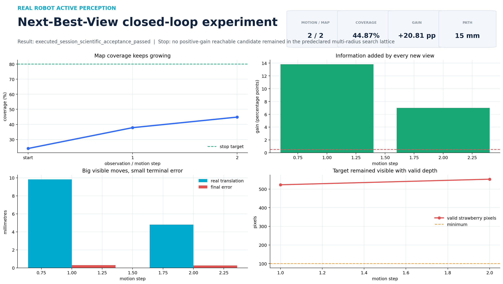
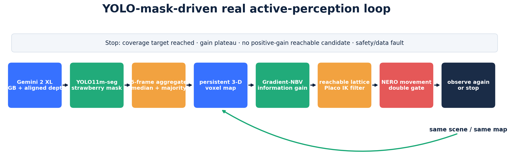
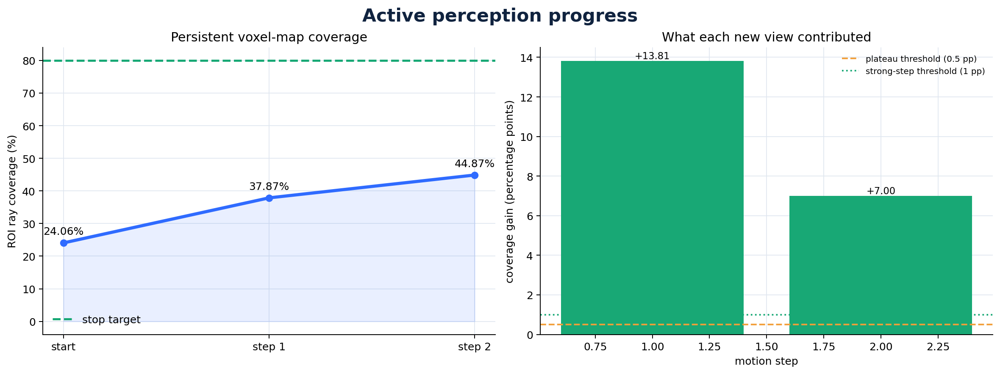
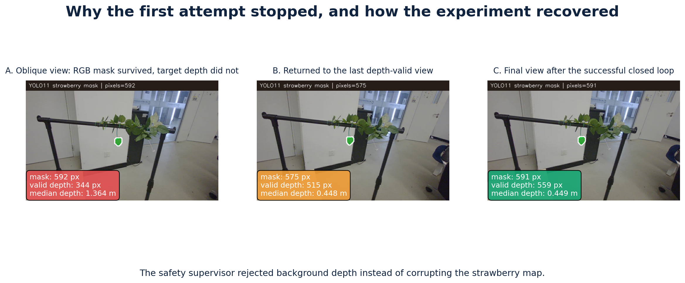
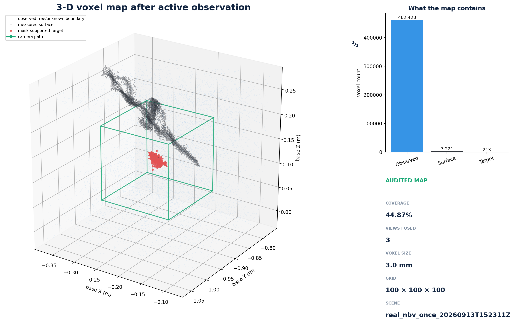

# Week 10：YOLO11 mask 驱动的真实多步 NBV 闭环

## 一句话结论

2026-09-13，Gemini 2 XL 拍到草莓后，YOLO11m-seg 自动给出草莓轮廓；Gradient-NBV 在
同一张三维体素地图里连续选择了 2 个新视角，NERO 机械臂完成两次运动。ROI 射线覆盖率从
`24.06% → 37.87% → 44.87%`，总增量 `20.81` 个百分点。随后固定的可达候选网格中没有
剩余的正收益视角，系统按算法停止。它没有达到人为设置的 `80%` 上限，但达到了项目既定的
真实多步科学验收条件：至少两步各增加 1 个百分点，最终比第一帧增加至少 20 个百分点。



这次第一次把“学习式草莓 mask”真正接入了完整实机闭环，而不只是离线识别或只读预演：

```text
Gemini RGB-D → YOLO11 草莓 mask → 五帧聚合 → 同一体素地图
    → Gradient-NBV → 可达候选 + Placo IK → NERO 运动 → 再观察
```



## 实验结果

| 项目 | 实测结果 |
|---|---:|
| YOLO 模型 | YOLO11m-seg，类别 `strawberry` |
| 置信度门槛 | `0.70` |
| 模型 SHA-256 | `7bea8d97…9c49357` |
| coverage 目标上限 | `80%` |
| 实际停止 coverage | `44.87%` |
| coverage 总增量 | `+20.81` 个百分点 |
| 高层 NBV 动作 | `2` 个 |
| 实际相机平移 | `9.83 mm`、`4.80 mm` |
| 实际相机旋转 | `1.74°`、`0.64°` |
| 动作后位置误差 | `0.30 mm`、`0.27 mm` |
| 动作后有效 mask 深度像素 | `523`、`553`（门槛 100） |
| `/control/move_j` 平滑轨迹采样点 | `29`、`20` |
| 地图 Configure 次数 | `1`（证明三帧在同一张图里） |
| 每步软件门 | 两道门均双重关闭并复核静止 |
| 最终停止原因 | 没有剩余“可达且正收益”的候选 |

这里的 coverage 是“草莓附近 15 cm 立方 ROI 中，有多少 3 mm 体素被有效深度射线碰到”，
不是“草莓表面已经看清百分之多少”。因此 `80%` 是一个允许提前停止的上限，不是必须硬凑
到 80% 的任务指标。当有限候选里已经没有正收益点时，继续走只会产生没有依据的运动。



## 中间发生了什么，为什么没有污染地图

第一次尝试实际完成了 `25 mm` 和 `50 mm` 两个动作。第二个斜视角中，YOLO 仍正确圈出
草莓，但 Gemini 在这个很小、较光滑的目标上没有返回草莓表面深度；mask 内的有效值全部
来自后方约 `1.364 m` 的背景，而草莓应在约 `0.448 m`。监督器发现三维目标中心相差
`0.934 m`，立即停止后续动作并保持两道门关闭，没有把背景融合成草莓。

机械臂随后沿已验证路径分两段回到上一深度有效视角；mask 内有效草莓深度恢复到 515 个
像素。重新实验时把冻结的 NBV/lattice 单步上限设为 `25 mm`，最终闭环全程保持
`0.446–0.449 m` 的目标深度。下图从左到右是：失效斜视角、恢复后、成功闭环最终视角。



本轮还修复了一个软件边界：以前 `ConfigureNBV.max_step` 只限制梯度优化器，外围可达候选
仍可能重新加入更大的距离；现在两者都服从同一个冻结值，并有回归测试。科研默认配置和
独立的大空间配置没有被永久放宽。

## 怎样看三维地图

三张地图快照分别对应初始视角、第一次动作后、第二次动作后。淡蓝点是射线经过的空间，
黑点是相机测到的表面，红点是 YOLO mask 支持的目标体素，绿线是相机路径，绿色线框是
目标 ROI。



- [旋转查看最终三维地图](artifacts/voxel/voxel_cloud_spin.gif)
- [查看三帧地图生长动画](artifacts/voxel/voxel_cloud_growth.gif)
- [查看三视图体素地图动画](artifacts/session/map/nbv_map_progress.gif)
- [查看三维相机轨迹](artifacts/session/02_camera_trajectory_3d.png)
- [查看候选筛选漏斗](artifacts/session/03_candidate_funnel.png)
- [查看初始候选点分布](artifacts/reachable_candidates.png)
- [浏览全部图表的 HTML 页面](artifacts/session/index.html)

候选图中，灰色叉号是 IK/安全门拒绝点，橙色是可达但没有正收益，蓝色是可达且有收益，
绿色星号是最终选择。终止前的第三轮候选仍被保存，所以可以证明程序确实检查过下一步，
不是因为写死“两步”才停止。

## 可复现证据

仓库提交了本次小型证据，不提交模型本体和大型原始流：

- [只读 preview](artifacts/evidence/yolo11_nbv_preview_target80.json)，SHA-256
  `43cb379c0add614d20ac2492d48e2f443c86e141aaf929ae2183f85b7e1626cf`；
- [真实 execution](artifacts/evidence/yolo11_nbv_execution_target80.json)，SHA-256
  `e0d16b45392f956cebd57fae86e62b470ddadd4e8d4092e3d2d7ea749ca73136`；
- 3 份地图快照 SHA 依次为 `550ed136…f716`、`50215066…cdc8`、
  `84cc59c2…ec10`；
- [精简结果 JSON](artifacts/yolo11_real_nbv_summary.json)；
- [全部 36 个文件的 SHA 清单](artifacts/manifest.json)。

正式手眼报告仍是
`validation/week3/artifacts/stability_pose001_030_factory_raw_D.json`，SHA-256
`31eb93b2b80663b895eac564afc8f633b4310a6b7c5e519340d97d163f22825f`。

## 只重画图，不接硬件

以下命令只读取仓库内 JSON/NPZ，不创建 ROS 节点，也不会运动机械臂：

```bash
cd /home/yyt/strawberry_active_perception

PYTHONPATH=perception_ws/src/strawberry_gradient_nbv \
  /usr/bin/python3 validation/week7/session_visualization.py \
  validation/week10/artifacts/evidence/yolo11_nbv_execution_target80.json \
  --output-dir /tmp/yolo11-nbv-session \
  --snapshots validation/week10/artifacts/evidence/map_step_*.npz

PYTHONPATH=perception_ws/src/strawberry_gradient_nbv \
  /usr/bin/python3 validation/week7/voxel_cloud_visualization.py \
  validation/week10/artifacts/evidence/map_step_*.npz \
  --output-dir /tmp/yolo11-nbv-voxel

/usr/bin/python3 validation/week6/reachable_candidate_visualization.py \
  validation/week10/artifacts/evidence/yolo11_nbv_preview_target80.json \
  --output /tmp/yolo11-nbv-candidates.png
```

`render_yolo_nbv_summary.py` 还会生成流程图、失效/恢复三联图、精简 JSON 和总 SHA 清单；
它需要本机保留的三个现场 overlay/report，完整调用参数可运行 `--help` 查看。

## 从零重新做一次真实实验

### 1. 上电前

先运行 `./verify_software.sh`。把本次审核过的模型复制到本地忽略目录并核对哈希：

```bash
mkdir -p artifacts/models
cp /home/yyt/Downloads/best.pt artifacts/models/yolo11m_strawberry_best.pt
sha256sum artifacts/models/yolo11m_strawberry_best.pt
# 必须是 7bea8d97b68c8081f1949538ec8a6ef14324c1f9ab9ae1b75ddefd2889c49357
```

### 2. 四个常驻终端

清空完整机械臂扫掠区、固定草莓、观察员就位后再上电。先激活 CAN，然后分别保持以下进程：

```bash
# 终端 A：Gemini
./camera_operator.sh start

# 终端 B：YOLO mask
./mask_operator.sh start

# 终端 C：Gradient-NBV
source /opt/ros/jazzy/setup.bash
source perception_ws/install/setup.bash
export ROS_DOMAIN_ID=77 ROS_AUTOMATIC_DISCOVERY_RANGE=LOCALHOST
.venv-nbv/bin/python -m strawberry_gradient_nbv.ros_node --ros-args \
  --params-file perception_ws/install/strawberry_gradient_nbv/share/\
strawberry_gradient_nbv/config/real_nbv.yaml

# 终端 D：NERO 反馈与控制器；启动后两道运动门仍为关闭
source /opt/ros/jazzy/setup.bash
source .venv/bin/activate
source nero_ws/install/setup.bash
export ROS_DOMAIN_ID=77 ROS_AUTOMATIC_DISCOVERY_RANGE=LOCALHOST
ros2 launch strawberry_nero_control real.launch.py \
  profile_config_file:=$PWD/nero_ws/install/strawberry_nero_control/share/\
strawberry_nero_control/config/large_nbv_experiment.yaml \
  can_port:=can0 speed_percent:=10 startup_enable:=true \
  precision_test_mode:=true first_motion_test_mode:=false \
  allow_limit_recovery_execution:=false launch_rviz:=false
```

状态检查：

```bash
./camera_operator.sh usb
./camera_operator.sh status
./mask_operator.sh status
./mask_operator.sh test
./robot_operator.sh can
./robot_operator.sh status
./robot_operator.sh pose
```

### 3. 先生成不运动的计划

```bash
source /opt/ros/jazzy/setup.bash
source perception_ws/install/setup.bash
source nero_ws/install/setup.bash
export ROS_DOMAIN_ID=77 ROS_AUTOMATIC_DISCOVERY_RANGE=LOCALHOST

ros2 run strawberry_active_perception_bridge real_nbv_supervisor --ros-args \
  --params-file perception_ws/install/strawberry_active_perception_bridge/share/\
strawberry_active_perception_bridge/config/real_nbv_supervisor_large_step.yaml \
  --params-file perception_ws/install/strawberry_learned_mask/share/\
strawberry_learned_mask/config/real_nbv_use_learned_mask.yaml \
  -p execute:=false -p coverage_target:=0.80 -p max_step_m:=0.025 \
  -p output_path:=$PWD/artifacts/week10/new_preview.json

sha256sum artifacts/week10/new_preview.json
jq '{status, coverage:.raw_next_view.coverage, selected:.selected_candidate}' \
  artifacts/week10/new_preview.json
```

必须看到 `status=passed_preview_only`。每次新实验都必须生成新文件；旧 preview 的起点和一次性
授权都不能复用。

### 4. 执行最多八步，但由收敛条件决定何时停止

把下面 `<64位SHA>` 换成刚得到的完整值：

```bash
ros2 run strawberry_active_perception_bridge real_nbv_supervisor --ros-args \
  --params-file perception_ws/install/strawberry_active_perception_bridge/share/\
strawberry_active_perception_bridge/config/real_nbv_supervisor_large_step.yaml \
  --params-file perception_ws/install/strawberry_learned_mask/share/\
strawberry_learned_mask/config/real_nbv_use_learned_mask.yaml \
  -p execute:=true -p coverage_target:=0.80 -p max_step_m:=0.025 \
  -p execution_plan_path:=$PWD/artifacts/week10/new_preview.json \
  -p execution_plan_sha256:=<64位SHA> \
  -p operator_workspace_clearance_confirmed:=true \
  -p execution_authorization_token:=EXECUTE_REAL_NBV_LARGE_SESSION_8 \
  -p authorization_receipt_path:=$PWD/artifacts/week10/new_receipt.json \
  -p execution_output_path:=$PWD/artifacts/week10/new_execution.json
```

最多 8 步只是防止无限循环。实际会在 coverage 达标、连续两步增量低于 0.5 个百分点、
没有正收益可达点、目标深度丢失或任何安全门失败时提前停止。当前系统没有环境碰撞模型，
所以不能无人值守；软件授权词也不能替代现场清场和观察员。

## 下一步

这次证明了完整工程链已经跑通。下一阶段不应简单把 80% 改成 90% 反复试，而应：

1. 给很小、光滑的草莓补强深度观测：优先测试更近距离、较正视角和多帧目标深度可靠度；
2. 把当前有限 18 方向扩成局部自适应候选，并对“可见但无目标深度”的方向记忆/避让；
3. 将 coverage 分成 ROI 射线覆盖和草莓表面覆盖两个指标；
4. 在不同草莓、不同位置和光照下重复 5–10 次，统计成功率，而不是只展示一次好结果。

双臂、自动采摘和无人值守连续运行仍不属于本阶段。
