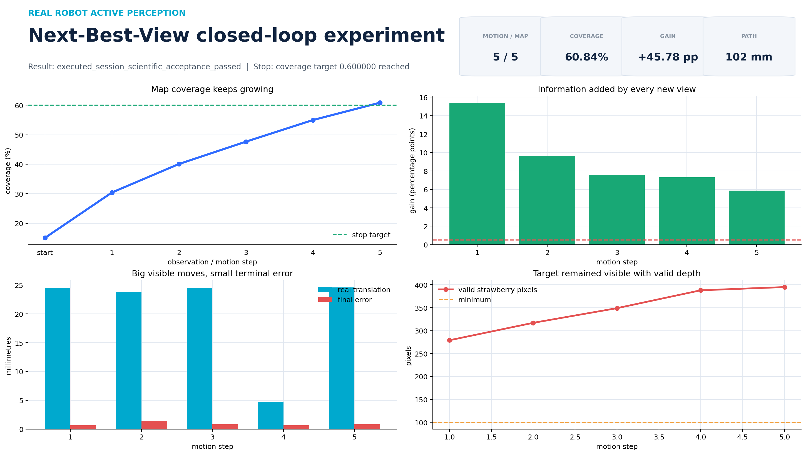

# Week 8：真实草莓五步 NBV 闭环（60% 停止线）

2026-09-13，本项目在 NERO 真机和 Gemini 2 XL 上完成了一次停止条件驱动的真实草莓
主动感知实验。目标 mask 仍来自 HSV 红色规则；它证明的是完整主动观察流程，不代表已经
接入学习式草莓语义分割。

## 一句话结果

相机从第一处位置开始，程序连续完成 5 次“拍照、更新同一张三维地图、筛选可达观察点、
移动、再拍照”，coverage 从 `15.06%` 增长到 `60.84%`，达到预先设置的 60% 停止线后
自动结束。五步总相机路径约 `102 mm`，五个高层运动目标全部完成，科学验收字段为通过。



## 五步结果

| 步骤 | 实际平移 | 实际转动 | 更新后 coverage | 本步新增 | 到位误差 | 有效草莓深度像素 |
|---:|---:|---:|---:|---:|---:|---:|
| 1 | 24.6 mm | 1.56° | 30.43% | +15.37 pp | 0.65 mm / 0.019° | 279 |
| 2 | 23.8 mm | 1.93° | 40.08% | +9.64 pp | 1.43 mm / 0.012° | 317 |
| 3 | 24.5 mm | 1.31° | 47.65% | +7.57 pp | 0.84 mm / 0.021° | 349 |
| 4 | 4.7 mm | 0.34° | 54.97% | +7.33 pp | 0.63 mm / 0.003° | 388 |
| 5 | 24.6 mm | 2.55° | 60.84% | +5.87 pp | 0.86 mm / 0.035° | 395 |

`pp` 是百分点。这里的 coverage 是“草莓周围 15 cm 立方体中，被有效深度射线碰过的
体素比例”，不是草莓表面真实完成度。

## 图片入口

- [覆盖率曲线](artifacts/coverage_curve.png)：每次观察后蓝线都上升，虚线是 60% 停止线。
- [相机三维轨迹](artifacts/camera_trajectory_3d.png)：显示五次真实相机位姿变化。
- [七个视角与 mask 拼图](artifacts/observation_contact_sheet.png)：绿色区域是 HSV 规则给出的草莓 mask。
- [最终三维体素云](artifacts/voxel_cloud_final_3d.png)：淡蓝是观察射线，黑色是测量表面，红色是目标体素。
- [地图增长动画](artifacts/voxel_cloud_growth.gif)：按时间看地图从少到多。
- [三维旋转动画](artifacts/voxel_cloud_spin.gif)：从不同方向查看最终地图。
- [自动生成的中文报告](artifacts/REPORT_CN.md)。

完整本机展示包位于：

```text
artifacts/week8/run_20260913_2025/presentation/
```

其中还包括每一步候选点漏斗、计划/实际运动、IK 安全指标、时间线、每张 RGB/depth/mask/
点云四联图，以及浏览器入口 `session/index.html`。原始 rosbag、10 份规范 Observation、
每步地图 NPZ 和完整审计 JSON 保存在本机 `artifacts/`，不提交大体积数据。

## 可复现证据

- 只读计划：[`real_nbv_preview_target60.json`](artifacts/real_nbv_preview_target60.json)，
  SHA-256 `b71b67236c1d4c7f65d5e0eda397d6fb18f813461e2e433cab0337d70a32058f`。
- 真机执行：[`real_nbv_execution_target60.json`](artifacts/real_nbv_execution_target60.json)，
  SHA-256 `87d7dd1f854f5782f59392de575bb8299220c0eb5c3af8640bf7b78190c14dae`。
- 正式手眼报告：`validation/week3/artifacts/stability_pose001_030_factory_raw_D.json`，
  SHA-256 `31eb93b2b80663b895eac564afc8f633b4310a6b7c5e519340d97d163f22825f`。
- 地图场景：`real_nbv_once_20260913T122322Z`，同一 generation 内共有 6 份地图快照：
  初始观察 1 份，加五次运动后的观察 5 份。

## 再做一次同类实验

先运行根目录 [README](../../README.md) 的构建、软件测试和硬件检查。相机、机器人反馈、
Gradient-NBV 都启动后，先生成不运动的计划：

```bash
cd /home/yyt/strawberry_active_perception
source /opt/ros/jazzy/setup.bash
source perception_ws/install/setup.bash
source nero_ws/install/setup.bash
export ROS_DOMAIN_ID=77 ROS_LOCALHOST_ONLY=1

ros2 run strawberry_active_perception_bridge real_nbv_supervisor --ros-args \
  --params-file perception_ws/install/strawberry_active_perception_bridge/share/strawberry_active_perception_bridge/config/real_nbv_supervisor_large_step.yaml \
  -p execute:=false -p coverage_target:=0.60 \
  -p output_path:=/绝对路径/preview.json
sha256sum /绝对路径/preview.json
```

确认 JSON 的 `status` 是 `passed_preview_only` 后，执行端必须使用刚才文件的完整 SHA；
具体真机命令见
[`strawberry_active_perception_bridge/README.md`](../../perception_ws/src/strawberry_active_perception_bridge/README.md)。
授权文件一次性使用，不能拿旧计划在新起点重复执行。

离线重新生成展示图不会连接相机或机械臂：

```bash
PYTHONPATH=perception_ws/src/strawberry_gradient_nbv \
  /usr/bin/python3 validation/week7/session_visualization.py \
  artifacts/week8/run_20260913_2025/large_step_execution_target60.json \
  --output-dir /tmp/nbv-presentation \
  --snapshots artifacts/nbv_map_snapshots/real_nbv_once_20260913T122322Z/generation_010/map_step_*.npz

/usr/bin/python3 validation/week7/observation_visualization.py \
  artifacts/week8/run_20260913_2025/observations/observation_00{4,5,6,7,8,9}_*.npz \
  artifacts/week8/run_20260913_2025/observations/observation_010_*.npz \
  --output-dir /tmp/nbv-observations

PYTHONPATH=perception_ws/src/strawberry_gradient_nbv \
  /usr/bin/python3 validation/week7/voxel_cloud_visualization.py \
  artifacts/nbv_map_snapshots/real_nbv_once_20260913T122322Z/generation_010/map_step_*.npz \
  --output-dir /tmp/nbv-voxel-3d
```

## 本轮额外修复

手动重摆后，第 2、5 关节略微超出科研使用的保守范围。第一次恢复中，编码器刚开门时约
`0.0013 rad` 的自然稳定量被旧的 `0.001 rad` 门槛误判为反向运动，触发电子阻尼停机。
在托稳、断电重启后，本轮把**仅限大空间实验恢复**的死区改为 `0.003 rad`；真正超过该值
或持续反向仍会停止。修正后的恢复只移动第 2、5 关节，最大变化 `0.077 rad`，随后五步
闭环正常完成。科研默认运动限制没有因此放宽。
