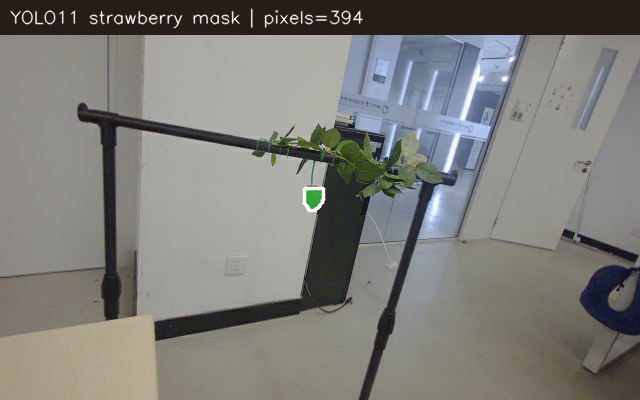
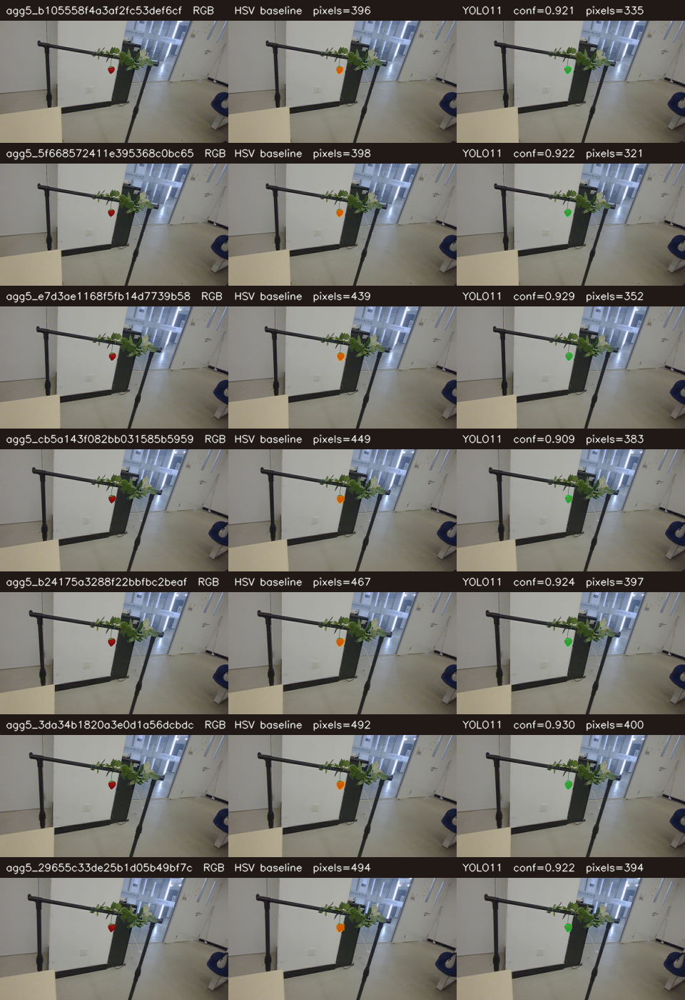
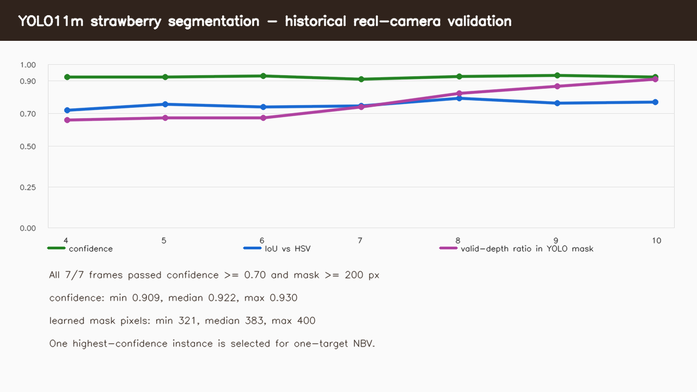

# Week 9：YOLO11m 草莓实例分割接入

本轮把用户提供的 `best.pt` 接到了统一 `Observation.target_mask` 接口。它只回答“图中
哪些像素属于草莓”，不修改深度、相机位姿、三维地图、NBV、手眼标定、IK 或机械臂控制。

## 一句话结果

模型已经完成**历史真机照片 + 当前相机实时照片**两级只读验证：历史 7 个机械臂视角全部
通过，当前实时帧置信度为 `0.925`，mask 有 `394` 个像素，其中 `352` 个像素带有效深度。
整个验证没有发送机械臂命令。随后完成了全链 `execute=false` 预演：YOLO mask 经五帧
聚合进入体素地图，Gradient-NBV、可达候选筛选和 Placo IK 全部通过，监听到的运动命令仍
为 0。学习式 mask 尚未驱动真机运动；下一步真机实验必须使用这类新计划，不能复用过去
的 HSV 计划。



白线内的绿色区域就是 YOLO 认为属于草莓的像素。这个结果会进入后面的深度反投影和三维
体素地图。

## 权重审计

- 原文件：`/home/yyt/Downloads/best.pt`；大小 `45,192,111` bytes；
- SHA-256：`7bea8d97b68c8081f1949538ec8a6ef14324c1f9ab9ae1b75ddefd2889c49357`；
- 模型：Ultralytics `YOLO11m-seg`，内嵌版本 `8.3.74`；
- 任务：实例分割；类别表只有 `0: strawberry`，没有发现其他类别；
- `.pt` 含 pickle，因此程序只在完整 SHA 匹配后加载；
- 权重和训练数据的再分发许可没有提供，所以权重保存在 Git 忽略的本机
  `artifacts/models/`，不提交到公开仓库。

## 为什么仍设置 0.70 置信度

虽然模型只有一个类别，一张图仍可能给出多个“疑似草莓”。历史照片中真正目标的最高
置信度为 `0.909–0.930`，其他重复/误检候选最高只有 `0.350`。因此 `0.70` 能稳定保留
目标并过滤低分候选。当前策略只选择置信度最高的一颗草莓，以匹配“一颗草莓一个 NBV
会话”的地图语义。



每行是同一真实相机帧：左边原图，中间旧 HSV，右边 YOLO11。YOLO 与 HSV 的 IoU 为
`0.720–0.793`，但 YOLO 的含义是“草莓实例”，不只是“红色”。



历史 7/7 帧同时满足：置信度至少 `0.70`、mask 至少 `200` 像素、有效深度至少 `100`
像素。CPU 首帧要加载模型，之后单帧约 `0.28–0.30 s`；当前实时帧约 `0.20 s`，满足
capture-on-demand 主动观察，不代表适合高帧率视频跟踪。

机器可读证据：

- [`yolo11_historical_report.json`](artifacts/yolo11_historical_report.json)；
- [`yolo11_live_report.json`](artifacts/yolo11_live_report.json)；
- [`yolo11_nbv_preview_summary.json`](artifacts/yolo11_nbv_preview_summary.json)；
- [`model_manifest.json`](model_manifest.json)。

全链只读预演使用两批、每批 5 帧的 YOLO mask。聚合后分别保留 `393 / 387` 个目标像素，
目标中心跨批漂移约 `0.99 mm`。初始体素 coverage 为 `19.63%`；原始梯度候选为 `100 mm`，
但当前关节姿态附近只有较小候选同时满足可达性和关节余量，最终只读选中 `10 mm / 0.82°`
候选。它通过 Placo IK（最大关节变化 `0.018 rad`，位置误差 `0.84 mm`），但没有执行。

## 软件结构

```text
Gemini canonical Observation（RGB + depth + K + pose）
                    ↓
strawberry_learned_mask（只替换 target_mask）
                    ↓
/strawberry/perception/learned_observation
                    ↓
原有 Gradient-NBV → Placo → 安全监督器
```

节点只有一个 Observation 订阅和一个 Observation 发布，没有 Service/Action client，也没有
机器人控制 topic。模型不合格时发布空 mask，使 NBV 确定性停止；不会偷偷回退到 HSV 后
继续运动。

## 从零复现

在项目根目录执行：

```bash
mkdir -p artifacts/models
cp /home/yyt/Downloads/best.pt artifacts/models/yolo11m_strawberry_best.pt
sha256sum artifacts/models/yolo11m_strawberry_best.pt

python3 -m venv --system-site-packages --prompt sap-mask .venv-mask
.venv-mask/bin/python -m pip install -r validation/week9/requirements-yolo11.txt

source /opt/ros/jazzy/setup.bash
source perception_ws/install/setup.bash
source .venv-mask/bin/activate
python -m colcon --log-base perception_ws/log build \
  --symlink-install --base-paths perception_ws/src \
  --build-base perception_ws/build --install-base perception_ws/install \
  --packages-select strawberry_learned_mask
deactivate
```

重新生成历史图（纯离线，不连接硬件）：

```bash
source /opt/ros/jazzy/setup.bash
source perception_ws/install/setup.bash
source .venv-mask/bin/activate
PYTHONPATH="$PWD/perception_ws/src/strawberry_learned_mask:$PYTHONPATH" \
python validation/week9/evaluate_historical_session.py \
  --checkpoint artifacts/models/yolo11m_strawberry_best.pt \
  --input-directory artifacts/week8/run_20260913_2025/observations \
  --output-directory /tmp/yolo11-history --first 4 --confidence 0.70
```

相机已经启动时，在一个终端保持运行：

```bash
./mask_operator.sh start
```

另一个终端只拍照测试：

```bash
./mask_operator.sh status
./mask_operator.sh test
```

`test` 只请求一帧图像并分割，不控制机械臂。通过后才能把
`config/real_nbv_use_learned_mask.yaml` 叠加到原 NBV supervisor 参数中，先做
`execute:=false` preview；真机运动仍需新的现场检查和新计划 SHA。
